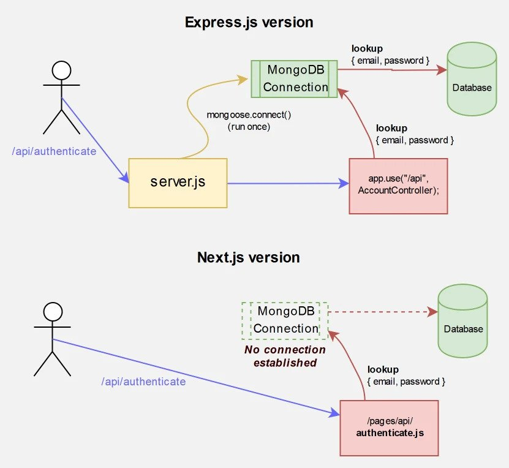

<h1>Walmart Dev Challenge</h1>

<ul>
    <li><a href="#introduction">Introduction</a></li>
    <li><a href="#technologies">Technologies</a></li>
    <li><a href="#ssr">NextJS & SSR: A Primer</a></li>
    <li><a href="#requirements">Requirements</a></li>
    <li><a href="#installation">Installation</a></li>
    <li><a href="#usage">Usage</a></li>
    <li><a href="#test">Testing</a></li>
    <li><a href="#Credits">Credits</a></li>
</ul>

<h3 id="introduction">Introduction</h3>

This is a solution for the Walmart Fullstack Challenge provided by Kibernum.

<h3 id="technologies">Technologies</h3>

The solution consists of an universal app with Server-Side Rendering with a tiny API using NextJS <a href="https://nextjs.org/docs/api-routes/introduction">API Routes</a>, a Mongoose database and served with Docker Compose.

<h4>Frontend</h4>
<ul>
    <li>NextJS</li>
    <li>Material UI</li>
    <li>Styled Components</li>
    <li>Axios</li>
    <li>Formik</li>
    <li>Yup</li>
    <li>Typescript</li>
    <li>TODO</li>
</ul>
<h4>Backend</h4>
<ul>
    <li>NextJS</li>
    <li>Mongoose</li>
    <li>Typescript</li>
</ul>

</ul>
<h3 id="ssr">NextJS & SSR: A Primer</h3>

Some of NextJS awesome features:

<ul>
    <li>Higher SEO score (using Lighthouse)</li>
    <li>Minimized client side rendering time (with client-side hydration)</li>
    <li>Secure server-side business logic</li>
    <li>Backend and Frontend unified in one project</li>
    <li>Universal built-in routing</li>
</ul>
<h3 id="requirements">Requirements</h3>
<ul>
    <li>Node > 12</li>
    <li>Docker & Docker Compose</li>
    <li>Yarn</li>
</ul>
<h3 id="installation">Installation</h3>

Clone this repo, then navigate to walmart-search-engine-app, then:

<code>
    yarn
</code>
<h3 id="usage">Usage</h3>

To make sure we are starting fresh use the following docker-compose command:

<code>docker-compose up --force-recreate</code>

The app will be available at <a href="http://localhost:3000/search/products">http://localhost:3000/search/products</a>

<h3 id="test">Testing</h3>

<code>
    yarn test
</code>
 

Code coverage:

<code>
    yarn test:coverage
</code>

<h3 id="Credits">Credits</h3>

<a href="https://github.com/dukuo">@dukuo</a> - Dilip Ramírez - dilip.ramirez@gmail.com

<h3 id="#todo">TODO</h3>
<ul>
    <li>More intensive unit & integration tests</li>
    <li>Async form submission onChange</li>
    <li>Responsive UI</li>
    <li>Better pagination</li>
    <li>Refactor utility methods</li>
    <li>Keep researching of proper git flow practices</li>
    <li>Optimize computing intensive methods</li>
</ul>